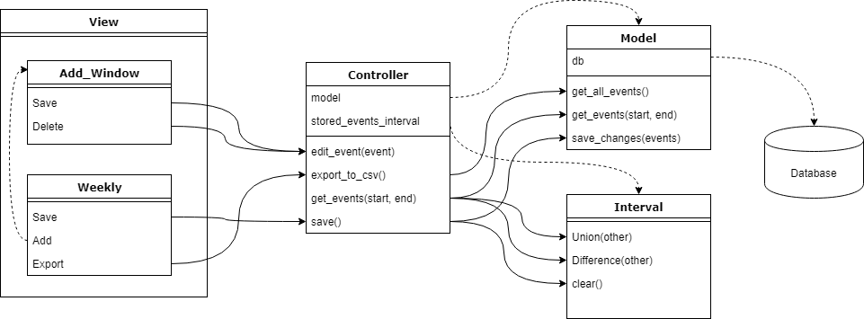

# CIS 422 Calender Project (Group 3)
By Alonzo Altamirano, Becca Araya, Taylor Santos, and Jieun Park

# 1. Team Roles
Role | Team Member | Responsibilities
---|---|---
System Architect|Taylor, Becca, Jieun| Specify designs that maintain accordance with system requirements with which modules will be implemented. Communicate with implementers in order to exact and refine designs.
Requirements Analyst| Everyone | Explore and specify objectively verifiable requirements of system and software. Communicate with system architects in order to exact and refine requirements.
Quality Control| Alonzo | Develop testing plans(procedures) and perform integration tests.
Developer(Back End)| Taylor, Becca | Realize(implement) designs of logical modules in accordance with specified requirements. Produce documentation for assisting developers and maintainers to utilize and modify the code.
Developer(Front End)| Jieun | Realize(implement) designs of user interface modules in accordance with specified requirements. Produce documentation for assisting developers and maintainers to utilize and modify the code. 
Technical Writer| Alonzo | Produce user documentation. Produce user manual. Maintain logs of group events.
Configuration Control| Taylor | Manage builds and modifications to the system. Facilitate usage of version control for all group members.
Project Management| Alonzo | Develop a Project Plan. Maintain progress of system development within project schedule. Facilitate communication within group.
Tester| Becca, Jieun, Taylor | Develop and perform unit tests on modules of the system.

# 2. Management Plan
To maintain communication, our group will use the application Slack for internal discussion throughout the development process.  In person meetings will be held each week at Knight Library or in Deschutes Hall to discuss current milestone progression and also team sentiment.  Version control will be managed using a private GitHub repository.  Task management for implementation stages will be performed using the application Trello.  Milestones should be completed prior to their due date.  Group work focus on subsequent milestones begins at the end of the completion of the previous milestone.  Major decisions for the project such as SRS, SDS, and build plans will be made by stakeholders at in person meetings.  Precise details regarding major project decisions will be explored and cemented at in person meetings as well as by using the Slack general thread.  Small, specific decisions about implementation will be made by the team member responsible for that portion of the project and will be communicated to relevant members using code documentation and Slack personal threads as well as in person meetings.

# 3. Software Requirements Specification
## Project Background
Our project is to produce a desktop application that assists end users in creating, viewing, and storing events in a calendar format.  The purpose of this system is to provide the end user with an organizational tool for their personal event planning. Prospective users are expected to be familiar with calendars, the usage of personal computers, and the usage of interfacing devices such as mouse, keyboard, and display.  End users are able to add events which possess information for an event’s name, date(s), start/end times, description, priority, and category.  End users are able to graphically view events for any given week and also view each event’s attributes.  End users are able to edit event attributes after creation and delete entire events.  All event data is stored in a database such that the end user may close and open the application as they wish and all modifications to information by the end user will be retained.

## Core Functionality Requirements:

### A. Functional
* A user will be able to Add, Edit, and Delete events. 
* A user will be able to manually choose when to save an event.
* User will have the option to specify event name, event description, event category, event priority, event start and end time.
* Events are not allowed to be input to the database with overlapping times.
* All events will be editable in their entirety, though with the same constraints as with their creation.  Constraints with creation are invalid dates(nonexistent or unspecified) and invalid times(nonexistent or unspecified).  Name strings must be less than 30 characters long, category must be less than 50 characters long, and description must be less than 300 characters.  Strings may contain tabs or newline characters in them, however tabs will be converted to four spaces and newlines will be converted to "\n".
* The user will be prompted to save events upon exit.
* All changes will be cemented in the database at closure of the program.
* All times displayed will be consistent with HH:MM format, use 15 minute blocks of time (e.g. 1:15PM, 1:30PM) for their display, and DD/MM/YYYY date format.
* With one click, a user can see the next or previous week.
* With three clicks maximum, a user can see any week.  Keyboard input is also required requiring 8 keystrokes maximum.
* From the display window, the user will have all 24 hours of the day available to view for a week.
* The system will generate no more than two additional windows for completing any one task.
* Events will not be allowed to be created if constraints for creation are not met as specified in the above section Logic/Processing as well as if the name is not provided.
* User is prompted as to what errors their event form contains relative to these constraints.
* User may view the attributes of an event after creation.
* A User can output the event data to a csv file.  The csv file will have the name "backup-yyyy-mm-dd.csv" and will have the format of "<start_date> tab <start_time>  tab <end_time> tab <name> tab <description> tab <category> tab <priority> tab <end_time>"

### B. Quality
* All requests(i.e. any act of input) run(i.e. stores, manipulates, and/or outputs) in half a second(500ms) or less.
* All transactions are high fidelity, in other words there are no errors when entering and retrieving or exchanging calendar data.
* All functionality will be component based to facilitate extensibility.
* Database is capable of storing at least one thousand events.

## Advanced Functionality Requirements:

### A. Functional  
* High-priority events are color coded. 
* A button will be available to jump to the current week.
* Users will be notified if a new event overlaps with an existing event.
* Users are allowed to enter multi-day events.

## Use Cases

1. Case: A user wishes to add an event to their calendar.
  * User opens application.
  * User clicks "Add" button.
  * User fills out form with valid data to specify event attributes.
  * User clicks button to add event.  Prompted until input form is valid.
  
  Outcome: Event is added to calendar.
  
2. Case: A user wishes to edit an event.
  * User opens application.
  * User navigates to week of event.
  * User clicks on event block to display attributes form.
  * User edits event block.
  * User clicks "Save" button to edit event.  Prompted until input form is valid.
  
  Outcome: Event is edited in calendar.

3. Case: A user wishes to delete an event.
  * User opens application.
  * User navigates to week of event.
  * User clicks on event block to display attributes form.
  * User clicks "Delete" button to delete event.
  
  Outcome: Event is deleted from calendar.
  
4. Case: A user wishes to backup their events to csv.
  * User opens application.
  * User clicks "Export" to backup up events to csv.
  
  Outcome: Events in the data base are exported to csv in the directory of the executable.
    

# 4. Milestones and Schedule
Further details for milestones can be found in section 5. Build Plan.

1. **Explore Technologies and Libraries (Due: Tuesday 04/10/2018) Workers: All Stakeholders(Jieun, Taylor, Becca, Alonzo)**
  At this stage we will explore technologies to use in order to accomplish our goals more efficiently.  This includes programming languages and libraries for a database or GUI.  
2. **Project Plan, SRS, and SDS Complete (Due: Wednesday 04/11/2018) Workers: All Stakeholders(Jieun, Taylor, Becca, Alonzo)**
  We will have the initial Project Plan, SRS, and SDS completed at this milestone.  Copies are printed for submission and all stakeholders are prepared to present in class Thursday April 12th.  This information will provide communication and facilitate control for the future process of system development.
3. **Database Operational (Due: Friday 04/13/2018) Workers: Taylor and Becca**
  At this stage we will have a database library selected and an instance of this database that is operational.  Operational in this case means that the database should be existent, it should be possible to add events by any means and should be able to view events by any means.  Any means includes accessing binary data directly with any method or by accessing the database with a third party software.  This is the first step to being able to store our calendar events in a robust and efficient manner.
4. **Header Files Written for MVC (Due: Saturday 04/14/2018) Workers: Becca, Jieun, and Taylor**
  Write the initial header files for major components of the Model-View-Controller architecture.  This will define a clear fundamental structure for the components and also provide information for interfacing possibilities between these components.  With this information, work can be performed on individual components in parallel with minimal risk of future lack of interoperability.
5. **GUI Prototype (Due: Monday 04/16/2018) Workers: Jieun**
  Produce the initial mock up and, if possible, develop an initial functioning prototype.  Since we are new to GUI development, this will help us define what is necessary for the GUI to possess and thus what information to research further.
6. **Calendar and Event Representations and Processing (Due: Friday 04/20/2018) Workers: Becca, Taylor**
  Implement the Model component and create structs necessary for creating the events.  This is the main logic required for storing and retrieving events in the database.  Functions are created for getting an interval of events from the data base and for updating and deleting events from the database. 
7. **Model/Controller Integration (Due: Sunday 04/22/2018) Workers: Becca**
  At this stage the interface and communications between a Controller component and a Model component will be complete.  A Controller should be able to request and recieve events from a Model, manipulate the events in memory, and send commands to the Model for saving events.  
8. **View Integration (Due: Thursday 04/26/2018) Workers: Jieun**
  At this stage the interface and communications between a View component and a Controller component will be complete.  A View should be able to request events from the Controller, display event in a GUI, collect data and input from the GUI, and send signals for commands to the Controller to initiate saving.
9. **All System Requirements Are Met (Due: Saturday 04/28/2018) Workers: All Stakeholders(Jieun, Taylor, Becca, Alonzo)**
  At this stage all system requirements are complete, this includes milestones that are added after the initial SRS was produced.  Bug testing should now be performed to ensure that the software is robust and usable.  A method is produced for making the application accesible to prospective users.
10. **User Manual and User Documentation Written (Due: Sunday 04/29/2018) Workers: Alonzo**
  At this stage a manual for the user is produced to improve the usability of the software application.  Details to be included will be how to use the basic functionality of the program, such as viewing events, adding events, deleting events, editing events, and exporting the user's data to a backup file.

# 5. Build Plan

## Abstract:

During the scheduled time allotted for each system implementation milestone’s development, the following iterative process is performed:
   * System architects design a specific solution for achieving that milestone’s requirements.  This solution describes an intermediate level model detailing which exact components are to be built as well as the precise manner in which components will be interfaced with each other and with the current system.  System architects define platform/system specific implementation details for each component and for each of their interfaces.  System architects write a document detailing what specifications were decided upon for this(these) model(s), why these decisions were made, and what issues could arise from these decisions.
    * Implementers (Developers) acquire the design specification.  If design is ambiguous or otherwise necessitates revision, implementers consult with system architects to rectify design specifications before proceeding.
    * Implementers define coding tasks to perform in order to realize(implement) the design specification.  Implementers communicate amongst themselves as to how tasks are divided into discrete actions to be completed and how these actions are distributed between their group members.  As tasks are executed, a log of who executed each task and when is produced.  All code is documented with standard docstrings and includes comments where applicable.  Configuration control ensures proper configuration of the program and also version control.
    * Testers produce, store, and execute unit tests for newly built components and previously built components to ensure that each component is robust.  If unit tests fail, testers communicate with implementers to provide feedback and to rectify the errors that are discovered.
    * Quality controllers produce, store, and execute integration test for newly built components and previously built components to ensure that all interfaces and the system as a whole are robust.  If integration tests fail, quality controllers communicate with implementers to provide feedback and to rectify the errors that are discovered.
    * When this step is reached, working code consistent with the current milestone should be achieved.  This step should be reached prior to the scheduled due date of the milestone.
    
## Detailed:

### Phase 1: Preparation

Related Milestones: 1 2 3 4 5

In this phase, we will define the manner with which we will go about developing the entire physical system.  Here are the steps of this phase:

1. Decide what initial requirements we should include and how to make these requirements objectively verifiable. Record this information in the SRS.

2. Devise a software architecture and record this information in the SDS.

3. Devise a project plan for how we will complete this work and record this information in the initial Project Plan.

4. Decide on a programming language to use for the project.

5. Decide on what libraries to use for database and for GUI.

6. Devise an initial software design regarding interfacing.

7. Create a database with this database library.

8. Write the header files for major components.

9. Create a prototype GUI with this GUI library.

At the completion of this stage the system is limited to two disjoint components of limited functionality, a database and a rough GUI.  Besides these, specifications will have been produced for the design of components that are to be implemented in the future.  Workers on the project will be aware of their duties.  

### Phase 2: Core Logic

Related Milestones: 6 7

In this phase, we will implement the core code required for a calendar application.  Here are the steps of this phase:

1. We will begin by having a database with a schema for storing information related to calendar events.  

2. We will then write two structs for managing event information in memory, a DBStruct which is suited for use by the Model and database, and a ViewStruct, which is better suited for the Controller and View components.  

3. After we will write a Model that has functions for manipulating this database.  One function is written for each of the following features. 
* Opening the database
* Initializing the scheme of the database
* Getting all events from the database
* Getting a time range of events from the database
* Creating/Updating/Saving an inputted set of events into the database.  
* Closing the database

4. Next we will write a Controller that has functions for interacting with the Model and the View components.  One function is written for each of the following features.
* Editing an event's data in memory
* Requesting a time range of events from the Model
* Initiating a Create/Update/Save request to the Model
* Export the data stored in the the database to a csv
* Methods for converting DB structs to ViewStructs

5. Integrate the Controller and Model so that an instance of the Controller physically interacts with an instance of the Model.  Prior to this, artificial testing of the Controller's functionality is performed.  Afterwards, integration testing is performed.

### Phase 3: GUI

Related Milestones: 8

In this phase, we will implement the complete GUI for our program.  Here are the steps:

1. Create a main window for displaying events.  This window has buttons for moving between weeks, for adding an event, for saving data, and for exporting data to csv.  A selection menu for date is also a member of this UI.

2. Create a secondary window for specifying event information.  This will be used for adding and editing events.  This window will have fields for name and description.  It will have pressable buttons for deleting an event and saving that instance of the event.  It will have radio buttons for selecting priority and category of event.  

3. Write View class for encapsulating all of the visual functionality of the application.

4. Integrate the View with the Controller so that an instance of the View physically interacts with an instance of the Controller.  Prior to this, artificial testing of the View's functionality is performed.  Afterwards, integration testing is performed.  

### Phase 4: Completion

Related Milestones: 9 10

In this phase, the application will be prepared for deployment.  Here are the steps:

1. First, the application is scrutinized for bugs.  This is done through integration testing and performing the operations defined in Use Case procedures.  This may necessitate corrections at any level of the project and within any component.

2. Then, the application is packaged into an executable.

3. Next, a method for downloading the application is established.

4. Directions for installing the application are written.  This includes information about the computer system requirements and the third party software dependencies that must be installed by the user.

5. A manual instructing use of the application is written.  This includes what steps to take in order to add an event, to delete and event, to edit and event, to save events to the database, and to export all events to csv.  

6. Finally, a unified online location for acquiring all materials is established and published.  

## Rationale
We chose this ordering for our build plan in order to allow Phases 2 and 3 to be worked on in parallel.  Certain steps of the phases are dependent on each other, such as integrating a component with another, however a significant portion is capable of being completed independently of other parts.  For example, one implementer might focus on the Model while another works on the GUI and later on they may be connected.  

Deciding to build the GUI last is largely due to our collective lack of knowledge regarding Graphical User Interfaces.  We decided to select a library for the GUI early on and then develop the GUI later so that we would be able to spend a significant portion of time learning about how interfaces are implemented.  

Phase 4: Completion relies on the application having been developed.  Therefore all steps prior to this must be completed, which logically places this step at the very end of development.  

# 6. System Architecture
Our system is decomposed into 5 distinct modules: 

1. The Database: Events are stored in a database in a format which can be added to, updated, or deleted. 
2. The Model: This module handles database requests from other modules. The Model allows other modules to retrieve from and write to the database.
3. The Interval class: This module allows other modules to store and manipulate integer intervals. 
4. The Controller: This module serves as a cache between the user interface and the database. Previously requested events and unsaved changes are stored in the controller for faster retrieval. The controller is able to write backup files in CSV format.
5. The View: The user interface allows the user to view events by week, edit individual events, delete existing events, and add new events. Any changes, deletion, and additions must be explicitly saved by the user before being written to the database. The user may also request a CSV backup of all events using the View.

The various modules of our system. Dotted lines represent ownership/instantiation. Solid lines represent function calls.

Module Interaction

The View interacts exclusively with the Controller. Whenever events are to be drawn to the screen, the View must make a request to the Controller for events within a time range. When the user modifies or deletes an event, the View will send their changes to the Controller. When the user creates a new event, it is also sent to the Controller. When the user wishes to backup or save, their request is sent to the Controller.

The Controller interacts exclusively with both the Model and the Interval class. The Controller may request events from the Model within a given time range, or may make a request for all events. When given a save request, the Controller is able to pass a list of events to the Model to be updated in the database. When given a backup request, the Controller may request a list of all events from the model, which may then be written to a CSV backup file. Any time range of events stored by the Controller are represented using the Interval class. The controller may add and remove intervals using the Interval class.

The Model has exclusive access to the database. Any requests to read or write events must be parsed by the Model before getting sent to the database.

Design Rationale

We decided to use a database to store events to allow user data to be saved between sessions. Additionally, the database allows our system to quickly retrieve events without needing to read and store the entire dataset every time it needed to be accessed. Instead of developing our own database software, we looked to third party libraries to give us the functionality we needed. We considered SQLite, PostgreSQL, and MySQL. SQLite is embedded in the application, uses a file-based database, requires no installation or extra configuration on the user's system, and is very fast. MySQL has more SQL functionality than SQLite, works well with web applications, and is more secure. PostgreSQL is far more advanced than the other two solutions, which comes at the cost of lower performance and integration difficulty. We decided to use SQLite because we needed a database solution that was easy to use, would work with an offline application, and required as little work on the user's end as possible. Its downsides, such as lack of multi-user support and limited write volume, did not negatively impact our system's design requirements.

We decided it was vital that only one module could access the database. We realized early on that allowing any module to write to the database would make error handling and debugging very difficult. It would also reduce the overall modularity of our system by giving multiple modules similar functionality. Therefore we designed our Model module to have exclusive access over database I/O. More complex SQL functions are then abstracted away, exposing only simple methods for requesting specific ranges of events. 

We had concerns that database I/O could potentially reduce our system's performance beyond our stated performance goal of 500ms. We chose to design our system to minimize database accesses, especially in response to user input. We initially designed our Controller module as a cacheing system between the View and the Model, which could store a local copy of requested events in memory. Should an event be requested more than once, the local copy can be returned rather than re-retrieving it from the database. The procedure of storing events locally is abstracted away from the View. Any requests for data from the View come with the assumption that the Controller will successfully retrieve all the necessary data whether or not it is cached. The alternative to caching database entries would be to make a new database request every time data was needed, which was deemed to have too much of a potential performance hit.

While designing the Controller, we realized that changes made to any events by the View (including the addition of new events) could be cached in the Controller along with the cached database entries. This way, the combined changes over the course of a session could be saved to the database in bulk rather than one at a time. Additionally, this gives the user the option to discard the changes they've made. This includes deleting events, which would be an irreversible action without this functionality. An alternative design would incorporate this functionality in a distinct module from the Controller. Such a module would then need to have access to the Model to save its changes. The original Controller, when recieving a request for data, would need to overwrite its data with any changes stored in the new module before returning to the View. This would only slightly reduce the complexity of the Controller module while significantly increasing the complexity of our overall system.

Data requests from the View come in the form of time intervals. While the Controller is capable of cacheing all the events it retrieves from the Model, our initial design did not give it the ability to determine which intervals of time have been cached and which have not. Therefore, the Interval class was designed to give the Controller the ability to remember which intervals have been previously requested. Any new requests can be divided into cached and uncached intervals, so that only the uncached intervals get redirected to the Model.

For our user interface, we chose to use Qt. This library was designed specifically for our language of choice, C++. It is an extremely well-documented, cross-platform, feature-rich framework for developing user interfaces. It provides a comprehensive library of STL-like functionality which helps keep our View module encapsulate the complete functionality of our user interface. We also considered the GTK+ library. Unlike Qt, GTK+ is not native to C++ so would require additional bindings. Overall, we chose Qt due to the completeness of its functionality and documentation. 

# 7. Design Documentation

Model:

* `std::vector<struct db_event> get_all_events()`: Retrieve a vector of every event from the database. Used by the Controller to create a CSV backup.
* `std::vector<struct db_event> get_events(int64_t start, int64_t end)`: Retrieve a vector of every event overlapping with the time range (start, end). The Model's procedure for deciding which events to retrieve are abstracted from the controller.
* `void save_changes(std::vector<struct db_event> events)`: Pass in a vector of changed events to be stored in the database. New events are distinguished from old events by having a valid `db_id` attribute. Events to be deleted have their `deletion` attribute set to `true`. The distinct procedures for new events, old events, and deleted events are abstracted from the Controller.

Controller:

* `int edit_event(struct view_event event)`: Pass in a view_event struct. If the event is new, it will be saved in the controller. If the event already exits, its changes will be applied. Returns a unique identifier value used to find it in the controller.
*	`void export_to_csv()`: Sends a request to the Controller to output a .csv file containing records of every event in the database.
* `std::vector<struct view_event> get_events(struct tm *start, struct tm *end)`: Given start and end times formatted as `struct tm`s, returns a vector of every event overlapping with the time range. The procedure for deciding whether to take each event from cache or from the database is abstracted from the View.
*	`void save()`: Sends a request to the Controller to write all the cached changes to the database.

Interval:

* `void Union(Interval const& other)` and `void Union(interval_pair interval)`: Get the union of the given interval with the local interval. This means combining any overlapping intervals into one. Can be given either an instance of the Interval class or a single pair of integers.
*	`void Difference(Interval const& other)` and `void Difference(interval_pair interval)`: Get the difference of a given interval with the local interval. This means removing from the local interval any sections which overlap with the given interval. Can be given either an instance of the Interval class or a single pair of integers.
*	`void clear()`: Clears the stored interval information.

View:

* `class Weekly`: The primary window, handles displaying every event within any given week. Weeks can be cycled with "Prev" and "Next" buttons, or a custom date can be entered. The "Add" button opens a new window for creating a new event. The "Save" button calls the Controller's `save()` function. The "Backup" button calls the Controller's `export_to_csv()` function. Clicking on any displayed event brings up an editing window.
* `class Add_Window`: This window is opened any time a new event is created or an old event is clicked on. If it corresponds to an existing events, its text fields will fill with the preexisting data. Text boxes for name, category, and description as well as two date boxes for start and end time allow the user to enter information for the event. The "Save" button finalized the user's inputs into a visible event on the calendar. The "Delete" button cancels the editing process and removes the corresponding event, if there is one. The user may also close the window, undoing any changes made. If invalid entries are used, clicking the "Save" button results in a pop-up window informing the user of their mistake, followed by a new `Add_Window` appearing.
* `class Event_Button`: This class encapsulates the functionality of each event on-screen. It allows each event to be clicked on, and allows the View to iterate through and delete buttons when the week is changed.

# 8. Risks and Mitigation
Risk|Solution
---|---
SQLite becomes unusable for our project(a critical bug is discovered, SQLite library copies are deleted and support is discontinued, etc).|We will pursue usage of another database software to rely on from the pool of comparable technologies available(PostgreSQL, MySQL, etc).
QT becomes unusable for our project(a critical bug is discovered, QT is deleted and support is discontinued, etc).|We will pursue usage of another GUI library to rely on from the pool of comparable technologies available(GTK+, FLTK, etc).
We get behind schedule and the project is due soon.|We will cut out accounting for advanced functionality and focus on only the core function.  We will increase the hours that each of us devote to the project and if need be meet on additional occasions.
Someone gets sick or dies.| We will document our work and decisions not only to assist in future maintenance but also to account for this possibility.  By having multiple system architects and developers with knowledge of the same topics we will develop redundancy for this proposed eventuality.
Database file is corrupted or tampered with.| We will provide the user with information in the user manual for making a copy of the database file.

# 9. Resources and References  
<b id="f1">1</b>: https://sqlite.org/different.html [↩](#a1)  
<b id="f2">2</b>: http://www.vertabelo.com/blog/technical-articles/again-and-again-managing-recurring-events-in-a-data-model [↩](#a2)   
<b id="f3">3</b>: https://www.sqlite.org/cintro.html [↩](#a3) 
<b id="f4">4</b>: http://doc.qt.io/qt-5/reference-overview.html [↩](#4) 
